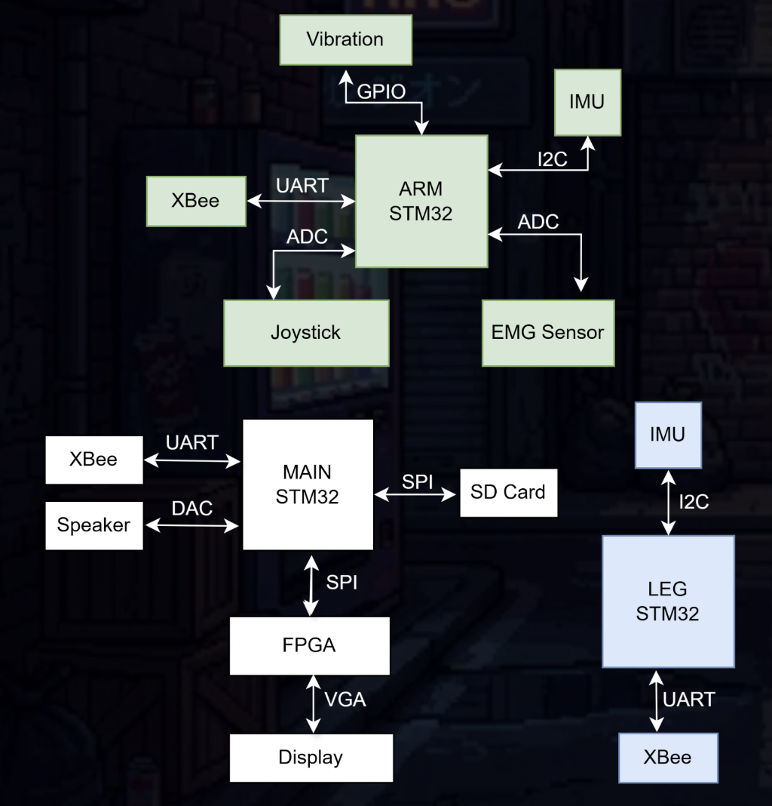

# Streetfighter 373

A motion-controlled combat game!  
Have you ever played streetfighter with a controller?  
Now imagine using your body instead; your movements in real life will now map to moves in the game!  

**Collaborators:** Alden Seki, Ellina Ho, Joshua Chen, Niki Lin, Sophia Chen  
**Course:** EECS 373 - Intro. to Embedded Systems Design @ University of Michigan  

## Tech Stack
* **Languages:** C, Python, Verilog  
* **Tools/Libraries**: STM32CubeIDE  

## Components & Features
* EMG <> Muscle Activity  
* IMU <> Punches & Jumps  
* XBee <> Wireless Communication  
* Joystick <> Player movement  
* Vibration Motor <> Haptic Feedback   
* Speaker <> Background Music, Sound Effects  
* VGA Display <> Game graphics & Animation  

## How to Play
### GAME
* Wear sensor packs on forearm and leg  
* Both players flex their arm to enter the game   
* Win by taking your opponent’s health points  
* Each round is 96 seconds  

### PLAY
* Move left & right with handheld joystick  
* Punch & jump … by punching and jumping!  
* Deal more damage by flexing your arm before punch  

## System Architecture
  

## Links
[Demo Video](https://drive.google.com/file/d/11FOnvJCIybzb1SUEQ8-KMvFGwjy_8Aex/view?usp=sharing)  

