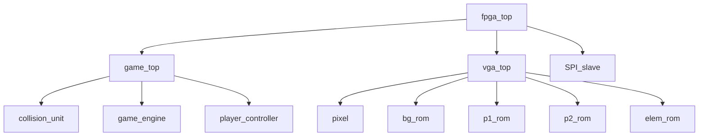

# Quartus Files

Everything ran on our Altera DE2

## Modules &  Topology

`fpga_top.v`: top level module for the FPGA, calls modules for VGA, game logic, and mainSTM   
`game_top.v`: top level module for game logic, wires variables between sub-game modules  
`vga_top.v`: animates different actions of the players by updating frame registers   
`SPI_slave.v`: // TODO  
`game_engine.v`: runs a state machine for game states   
`collision_unit`: // todo  
`player_controller`: determines player states   
`vga_pixel`: pixel module sits here - how the FPGA writes pixels to the VGA   
 
## Other Code Files
`allpins.csv`: pin configurations for VGA & STM32   
`*.mif`, `*_rom.*`: files generated for graphics  
